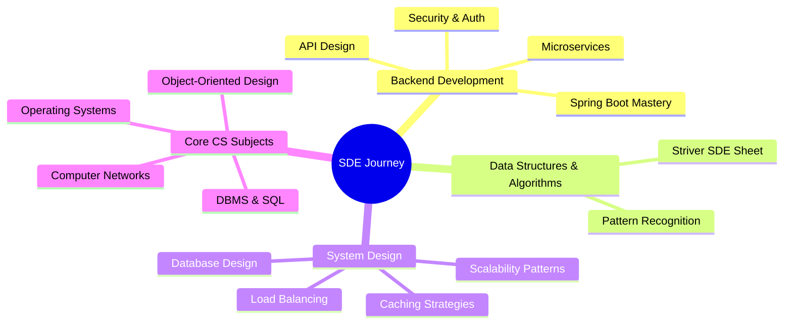

<div align="center">

# 👋 Hi, I'm Harshita Gupta


### 🚀 Aspiring SDE | Backend Developer | Graduating 2026

<p>
  
  
  
</p>

</div>

---

## 🎯 About Me

```yaml
name: Harshita Gupta
role: Final Year CSE Student | Aspiring Backend Developer
batch: 2026
education: B.Tech in Computer Science Engineering
location: Dehradun, Uttarakhand, India
status: Actively seeking SDE roles & internships

currently_learning:
  - Microservices Architecture
  - System Design Patterns
  - JWT Authentication & OAuth2
  - AWS Cloud Services
  
interests:
  - Building scalable REST APIs
  - Solving complex DSA problems
  - Contributing to open source
  - Cloud-native application development

motto: "Clean code, scalable systems, continuous learning"
```


### 💼 What I'm Learning & Building

- 🔧 Building backend systems with **Java & Spring Boot**
- 📊 Creating RESTful APIs with authentication & authorisation
- 🗄️ Working with relational databases and SQL query optimisation
- 🐳 Learning Docker for containerization and deployment
- 🧩 Practising DSA on LeetCode and GeeksforGeeks
- 📚 Studying system design fundamentals and scalability patterns

### 🎓 Current Goal

Actively seeking **SDE roles and internships** for 2026. Preparing through structured DSA practice, building production-ready projects, and learning system design principles. 

<br clear="both" />

---

## 🛠️ Tech Stack

<div align="center">

### Languages


### Backend & Frameworks


### Databases


### DevOps & Tools


</div>

---

## 🚀 Featured Projects

<table>
<tr>
<td width="50%">

### 🧩 Employee Management System
**Tech Stack:** Java · Spring Boot · JPA · MySQL · Docker

A comprehensive employee management platform with full CRUD operations, featuring:
- RESTful API architecture with proper exception handling
- Service-layer design with business logic separation
- JPA/Hibernate for database operations
- Input validation and error responses
- Dockerized deployment

[](https://github.com/hershiee/spring-boot-employee-management)

</td>
<td width="50%">

### 🛡️ ResolveIT - Grievance Management
**Tech Stack:** ReactJS · NodeJS · ExpressJS · MySQL · REST APIs

An intelligent grievance and feedback management system with:
- User authentication and role-based access control
- Automated ticket categorisation and tracking
- Admin dashboard for response management
- Real-time status updates

[](https://github.com/hershiee/ResolveIT---Smart-Grievance-Feedback-Management-System)

</td>
</tr>
</table>

<div align="center">

[](https://github.com/hershiee?tab=repositories)

</div>

---

## 📊 GitHub Statistics

<div align="center">


</div>

---

## 🏆 Achievements

<div align="center">


### 🎖️ Holopin Badges
[](https://holopin.io/@hershiee)

</div>

---

## 🎯 SDE Preparation Roadmap

<div align="center">

</div>
---

## 📈 Coding Profiles

<div align="center">

[](https://leetcode.com/hershiee)
[](https://auth.geeksforgeeks.org/user/hershiee)
[](https://www.hackerrank.com/hershiee)

</div>

---

## 🤝 Connect With Me

<div align="center">

[](https://linkedin.com/in/harshita-gupta-283a15172)
[](mailto:gharshita035@gmail.com)
[](https://github.com/hershiee)
[](#)

**📧 Email:** gharshita035@gmail.com  
**💼 Open to:** SDE Opportunities | Backend Engineering Roles | Internships

</div>

---

<div align="center">

### 💭 Random Dev Quote


### 🐍 Contribution Snake


---


**⚡ "Code is like humor. When you have to explain it, it's bad." – Cory House**

*Thanks for visiting! Feel free to explore my repositories and connect with me.* 🚀

</div>
