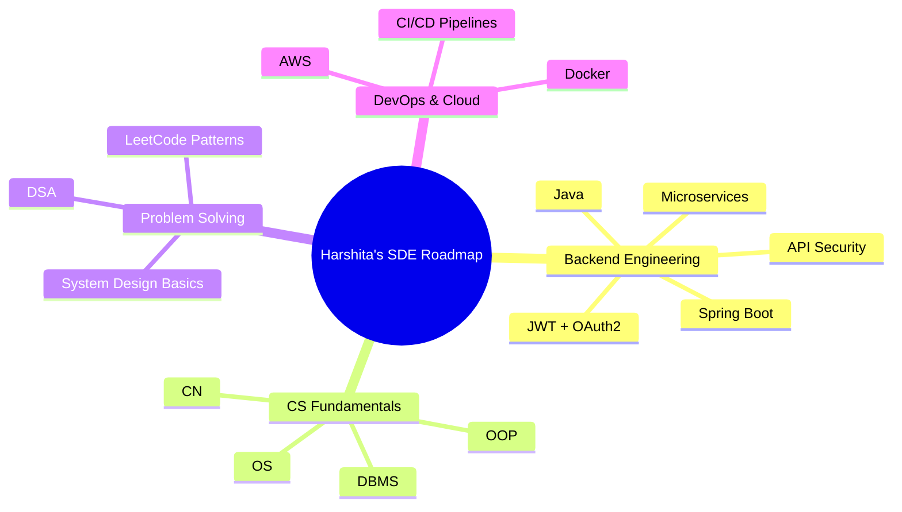

# Hi there! 👋 I'm Harshita Gupta

### 🚀 Software Development Engineer (SDE) in the Making
Focused on backend engineering, scalable system design, and high‑impact problem solving.

---

## 🎯 Profile Overview
🔹 Backend Engineer specializing in **Java, Spring Boot, REST APIs, SQL, Docker**  
🔹 Strong command over **Data Structures & Algorithms**   
🔹 Experience building **production‑ready backend systems** and deploying them on cloud    
🔹 Passionate about **clean architecture, scalability, performance & system design basics**

---

## 🏆 GitHub Trophies

  

## 🧩 Holopin Badges

---

## 🔥 About Me

💻 **Backend Developer | Java + Spring Boot**  
📌 Final Year CSE student preparing for **SDE roles (2026 batch)**  
🌱 Currently learning: **Microservices, System Design, JWT Auth, Cloud Deployment**  
⚙️ Love building: **REST APIs, scalable backend services, cloud‑ready apps**  
🚀 Fun Fact: I debug faster after coffee… but the bugs come back faster too ☕🐛

📩 **Email:** gharshita035@gmail.com

 

---

## 🌐 Connect With Me

---

## 🛠️ SDE Tech Stack

### 💻 Core Languages

### 🧱 Backend Engineering

### 🗄️ Databases

### ☁️ Cloud, CI/CD & DevOps

### 🧪 Tools

---

## 🚀 Featured SDE Projects
(To be filled with your best backend projects—just tell me the repo names and I will format them beautifully!)

---

## 📊 GitHub Analytics

### 🔥 Contribution Graph

### 📈 GitHub Stats

  
  

### 💻 Most Used Languages

### 🏅 Contribution Stats

---

## 🧠 SDE Focus Areas

---

## 🐍 Fun Extras

### 💭 Random Dev Quote

### 🐍 Snake Eating Contributions

---

**✨ "First, solve the problem. Then, write the code." – John Johnson**

