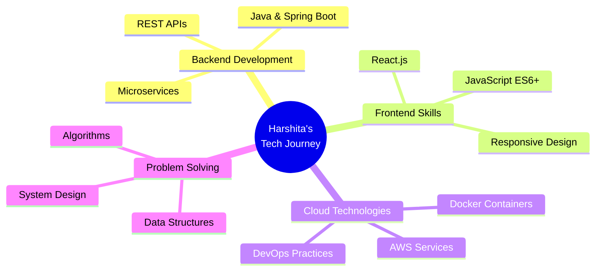

# Hi there! 👋 I'm Harshita Gupta

### 🚀 Passionate Software Developer from India 🇮🇳

---

## 🏆 GitHub Trophies

  
  

---

## 🔥 About Me

🌱 **Learning Journey:** Java | SpringBoot | DSA | AWS ☁️

💡 **Fun Fact:** I've got one foot in Java and the other in hackathons, making me a full-time bug fixer and part-time innovator! 🐛✨

📧 **Get In Touch:** gharshita035@gmail.com

🎯 **Goal:** Building scalable solutions that make a difference!

 

---

## 🌐 Connect With Me

---

## 🛠️ Tech Stack & Tools

### 💻 Programming Languages

### 🌐 Frontend Development

### 🔧 Backend Development

### 🗄️ Databases

### ☁️ Cloud & DevOps

### 🔨 Development Tools

---

## 📈 GitHub Analytics

  
### 🔥 Contribution Graph

### 📊 GitHub Stats

  

### 💻 Most Used Languages

### 📈 Contribution Stats

---

## 🎯 Current Focus

---

## 🏃‍♀️ Fun Stats

---

### 💭 Random Dev Quote

### 🐍 Watch my contributions get eaten by the snake!

---

**✨ "Code is like humor. When you have to explain it, it's bad." - Cory House**

⭐️ From [Harshita Gupta](https://github.com/hershiee)

